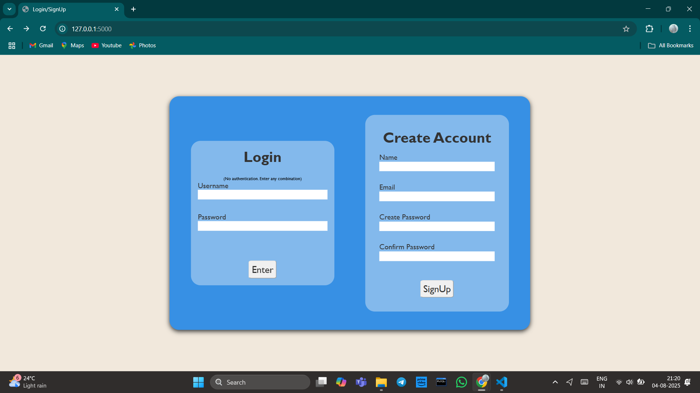
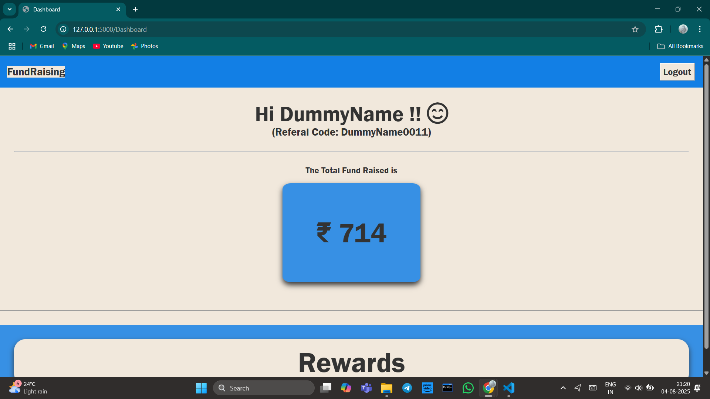
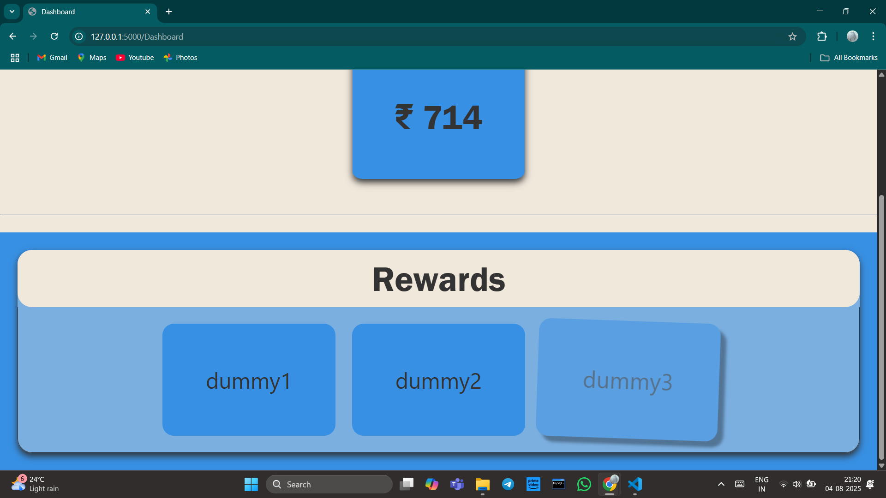

# 💻 FundRaiser_Web

This is a **login/sign-in UI demo** with a simple **dashboard** that displays the total donation raised. This project uses dummy values for login and shows a static dashboard after login. Signup entries are saved to MongoDB.

🔒 **Note**: No real authentication is implemented — this is a frontend + basic backend UI prototype.


## 🔧 Features

- Responsive login and signup forms
- Password input validation (`required`, `minlength`)
- Signup data is saved in MongoDB (dummy user creation)
- Static dashboard after login fetches data from backend showing:
  - Intern's name
  - Referral code
  - Total donation raised
  - Rewards
- HTML, CSS, JS frontend with Flask backend


## 📁 Project Structure

```bash
FundRaiser_Intern
├── Backend 
│   └── app.py
├── Frontend # Styling for the pages
│   ├── static
│   │   ├── css
│   │   └── js
│   └── templates
├── requirements.txt # requirements
├── OutputScreenShots #Output Screenshots and screen recording
└── README.md # Project info

```

##  📷 ScreenShots







[ 🎥 Click to Watch Demo](OutputScreenShot/FundRaiser_WebWork.mp4)

## 🚀 How to Run Locally

### 1. Clone the repo

git clone https://github.com/Muskan-Tarafder/FundRaiser_Web.git

cd FundRaiser_Web

### 2. Set up virtual environment

python -m venv venv

source venv/bin/activate       # On Linux/Mac

venv\Scripts\activate          # On Windows


### 3. Install the dependencies 

pip install -r requirements.txt

### 4. Set up MongoDB Atlas

Create a MongoDB Atlas cluster and replace the MongoDB connection string, Database name and Collection name in app.py

client = pymongo.MongoClient("your-mongodb-atlas-uri")

db=client["your-database-name"]

self.access=db["your-collection-name"]

### 5. Insert Sample Data

When signing up through the form, the system will automatically assign:
- A random total_donation amount
- Random rewards (from a predefined list)
This will populate your MongoDB users collection with new documents.
Alternatively, you can manually insert a sample document into your MongoDB collection:

```bash
{
  "name": "DummyName",
  "email": "dummy@example.com",
  "referral_code": "0123",
  "total_donation": 15000,
  "rewards": "T-shirt, Badge",
  "createdAt": "2025-08-02T12:00:00Z"

}
```
### 6. Run the Flask app

python Backend/app.py

visit the link generated.


🛠 Tech Stack
- Frontend: HTML5, CSS3, JavaScript
- Backend: Flask (Python)
- Database: MongoDB (Atlas)


📌 Notes
This is a dummy UI project — no real authentication or secure login.
Signup form saves data to the database; login form uses dummy checks.
Dashboard content is static or based on demo data fetched from MongoDB.


✍️ Author
Made by Muskan Tarafder as part of an internship assignment.
